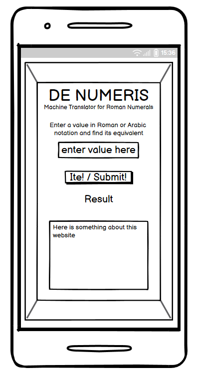
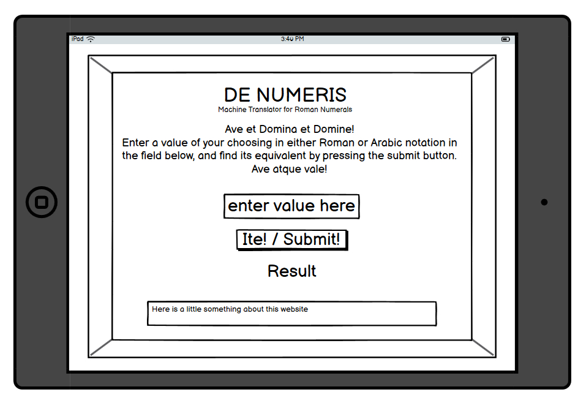
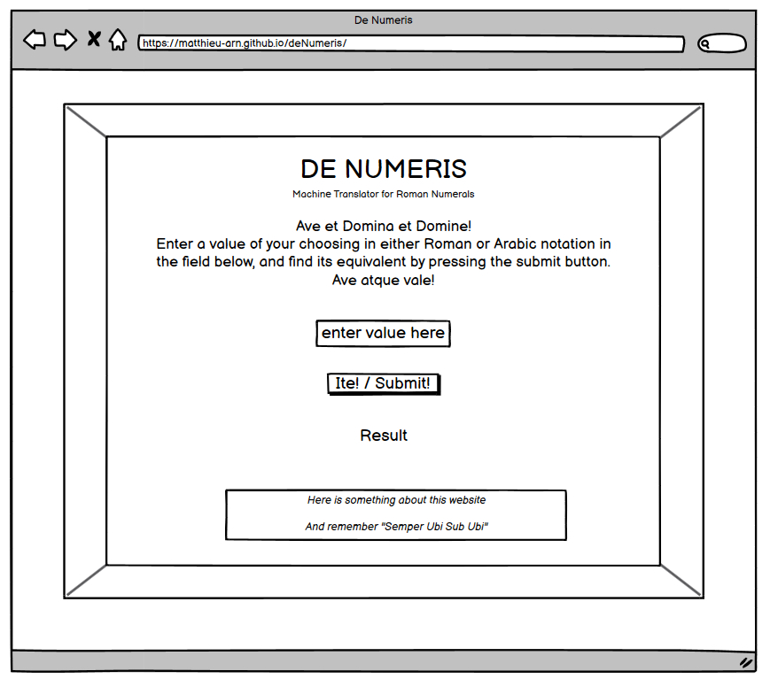

# **De Numeris** 

The page is deployed here: https://matthieu-arn.github.io/deNumeris/

**De Numeris** (*Of Numbers*) is a simple-to-use HTMLweb-based application to convert numbers from the Arabic system (using place value notation) to the Roman numerals system (using subtractive notation) and back.
This site is useful for curious-minded people who wish to translate monumental date inscriptions on the go, and more generally for those who wish to play around with numbers.

## User Experience

### User Stories
 - As a **user**, I want to **enter a number in Roman numeral notation in the required field**, so that **I can get its equivalent in Arabic notation**.
 - As a **user**, I want to **enter a number in Arabic notation in the required field**, so that **I can get its equivalent in Roman numeral form**.
 - As a **user**, I want to **interact with a simple interface**, so that **I can get answers rapidly**.

## Features

### Existing Features
  - Structure
      - The site lives on a single HTML page, with a single input field, and a single submit button
      - A simple header introduces the name of the site ("De Numeris") along with a short description of its purpose ("Machine Translator for Roman Numerals")
      - A simple footer provides copyright information
      - There is no link towards secondary pages on the site or towrds third-party pages
  - Presentation
      - The landing page includes a picture of the Colosseum in Rome to convey the general theme and purpose of the application
      - The input field accepts numbers between 1 and 3,999 (included) in either notation 
      - The submit button, when pressed, returns the translated figure in the output field
      - The refresh button, when pressed, clears both input and output fields

### Future Features
  - Extra HTML page to provide a brief introduction to the Roman numeral system and the differences with the more widespread Arabic notation
  - Extra JavaScript code to improve the Roman numeral checking function so as to catch legitimate letters used in a nonsensical order e.g.: IVLX
  - Extra JavaScript code to expand the current value range to allow values in excess of 1 million
  - Extra JavaScript code to expand the current value range to allow fractional values using the duodecimal system
  - Extra JavaScript code to offer a quiz along the lines of "Love Maths" with questions asked in either Arabic or Roman notation and answers to be given in either Arabic or Roman notation

## Design

### Imagery
  - The background(hero) image was chosen because ot its obvious relation to the purpose of the website. It depicts a section of the Western facade of the Colosseum in Rome, including gate numbers in Roman numerals above each visible gate (these are faint and not visible on all screens sizes)

### Colour Scheme
  - The colour scheme use a neutral stone/earth shade for the header and footer, in keeping with the ruins depicted in the hero image

### Typography
  - A font reminiscent of Roman monumnetal epigraphic inscriptions was chosen to remain in keeping with the overall theme
  - To this end, **Cormorant Garamond** was imported using Google Fonts

### Wireframes
  - Wireframes were created in Balsamiq prior to development, in order to gauge proportions and overall organisations of the page on different devices/screen sizes

## Technologies Used

### Languages Used
  - HTML5
  - CSS3
  - JavaScript ES6

### Resources & Programmes Used
  - Programmes & Tools
    - Google Fonts: for the Cormorant Garamond font used throughout the webpage
    - Emojipedia: for the emojis included in the browser tab and as refresh/reset button
    - GitPod & GitHub: for code development and code safekeeping respectively 
    - Balsamiq: to develop wireframes
    - Paint.net: to edit the images used in assets and documentation
    - Compressor: to compress background image 
    - Snipping Tool: to take screen captures of various documentation images
  - Resources
    - Coding Resources 
      - W3Schools https://www.w3schools.com/
      - Stack Overflow https://stackoverflow.com/
      - SheCodes https://www.shecodes.io/
      - GitHub Docs https://docs.github.com/en
      - Markdown Guide https://www.markdownguide.org/
      - Code Institute LMS https://learn.codeinstitute.net/ci_program/fsbootcamp231121
      - HTML Validator https://validator.w3.org/
      - CSS Validator https://jigsaw.w3.org/css-validator/
      - JavaScript Validator https://jshint.com/
      - Google DevTools https://developer.chrome.com/docs/devtools
    - Background Information
      - Wikipedia https://en.wikipedia.org/wiki/Main_Page
      - Wiktionary https://en.wiktionary.org/wiki/Wiktionary:Main_Page
      - Latin Discussion https://latindiscussion.org/
      - Dickinson College Commentaries https://dcc.dickinson.edu/

## Testing

### HTML Validation

### CSS Validation

### JavaScript Validation

### Lighthouse

### Browser Compatibility
  - Testing was carried out on the following:
    - Google Chrome Version 127.0.6533.120 (Official Build) (64-bit)
    - Mozilla Firefox Version 129.0.1 (64-bit)
    - Microsoft Edge Version 127.0.2651.105 (Official build) (64-bit)
    - Samsung Internet Version 26.0.1.3

### Known Bugs
  - Known responsive design issues across different screen sizes

## Deployment
  - The site was deployed from the early stages of development using GitHub
  - The live site can be found here: https://matthieu-arn.github.io/deNumeris/

## Credits

### Content
  - Original idea and design by the developer
  - Documentation on Roman numerals from Wikipedia
  - Latin text and interjections from various academic sites such as *Latin Discussion* and *Dickinson College Commentaries*

### Code
  - HTML structure adapted or inspired from several walkthrough projects as provided by the *Code Institute*'s LMS, in particular *Love Running*
  - CSS structure adapted or inspired from several walkthrough projects as provided by the *Code Institute*'s LMS, in particular *Love Running* (zoom effect), *Love Maths*, *BMI Calculator*, etc.
  - JavaScript structure adapted or inspired from several walkthrough projects as provided by the *Code Institute*'s LMS, in particular *Love Maths* and *BMI Calculator*
  - Algorithm in JavaScript to translate numbers designed by the developer
  - Several issues were resolved using documentation and archived discussion boards available from *W3Schools*, *Stack Overflow*, *She Codes*, etc.

### Media
  - Fonts imported from Google Fonts
  - Emojis from Emojipedia
  - Background image taken by the developer in Rome, December 2017
  

